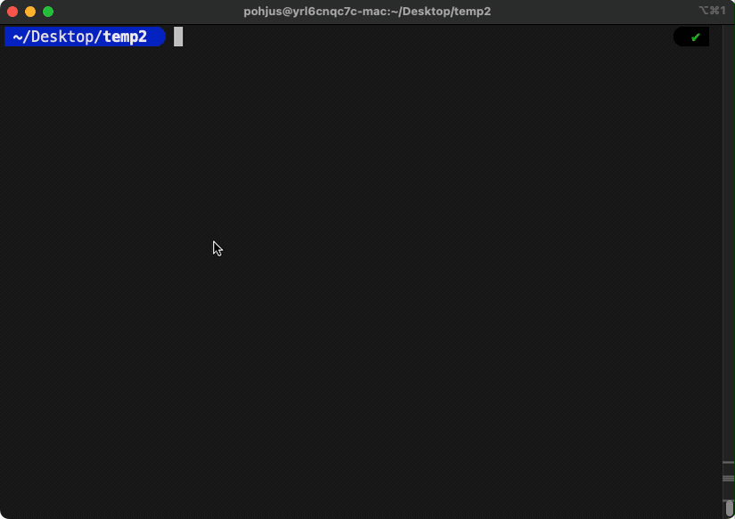
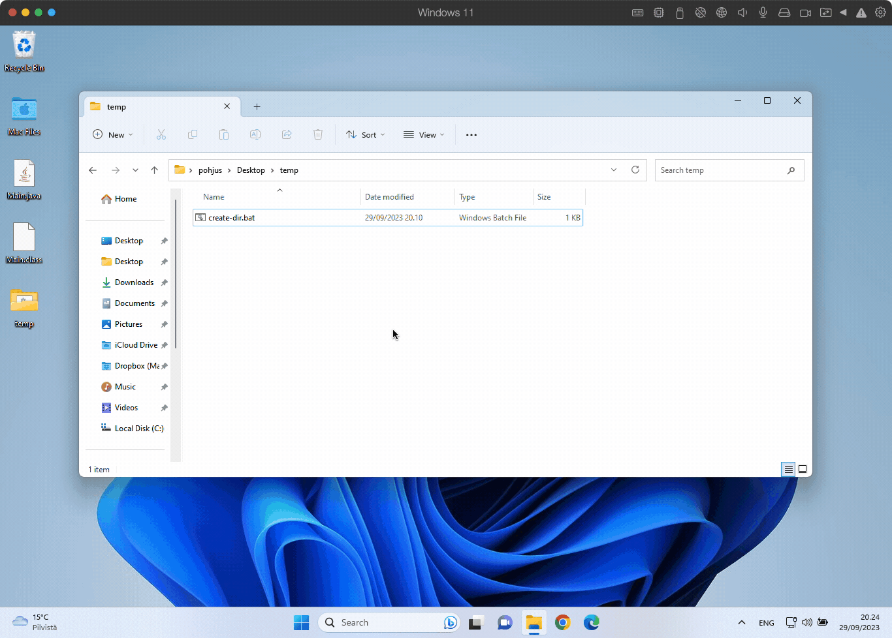

# Introduction to Programming: Exercise Set 04

This repository contains exercise set 04 for an Introduction to Programming course. Also some utility scripts
are included for creating a proper directory structure quickly.

## Quick Start for create-dir scripts

### ⚠️ Disclaimer

**Use these utility scripts at your own risk. Running these could potentially harm or destroy data on your computer. I am not responsible for any damage caused.**

See also similar tool by [Lassi-Ahonen](https://github.com/Lassi-Ahonen/): [java_homework_dir_gen](https://github.com/Lassi-Ahonen/java_homework_dir_gen).

### macOS / Linux

1. **Download the Script**: Obtain `util/create-dir.sh` and place it in a directory of your choice.

2. **Set Permissions**: Open terminal and navigate to the directory where `create-dir.sh` is stored. Then, set execute permissions:

```bash
   chmod +x create-dir.sh
```

3. Run the Script: Execute the script with a numerical argument (e.g., 10) to create directories and give your name also:

```bash
   ./create-dir.sh 10 "Jussi Pohjolainen"
```

Resulting Directory Structure

The script will create the following directories each containing a Main.java file with basic javadoc comments:

```text
.
├── e01
│   └── Main.java
├── e02
│   └── Main.java
...
└── e10
    └── Main.java
```

The `Main.java` will contain:

```java
/**
 * Main class for exercise.
 *
 * @author Jussi Pohjolainen
 */
public class Main {
    /**
     * Main method - starting point for the app.
     *
     * @param args Command line arguments
     */
    public static void main(String[] args) {

    }
}
```

### Example



### Windows

1. **Download the Script**: Obtain `util/create-dir.bat` and place it in a directory of your choice.
2. **Run as Administrator**: Open Command Prompt with administrator rights.
3. **Execute the Script**: Navigate to the script's directory and run:

```bash
create-dir.bat 10 "Jussi Pohjolainen"
```

### Example



## Quick Start for checkstyle

[Checkstyle](https://checkstyle.sourceforge.io) is a tool that checks if your code conforms to Oracle Code Conventions.

1. **Download jar and xml-files**: Obtain all files from `util\checkstyle\` and place them in a directory of your choice
2. **Run the jar file**: Give commmand `java -jar checkstyle-10.12.3-all.jar -c sun_checks.xml Main.java`, where `Main.java` is your code file.
